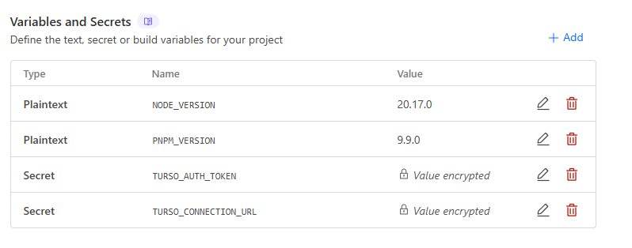
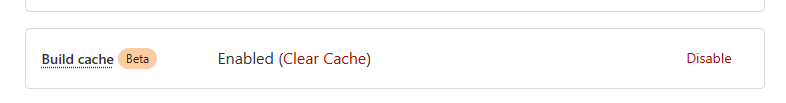
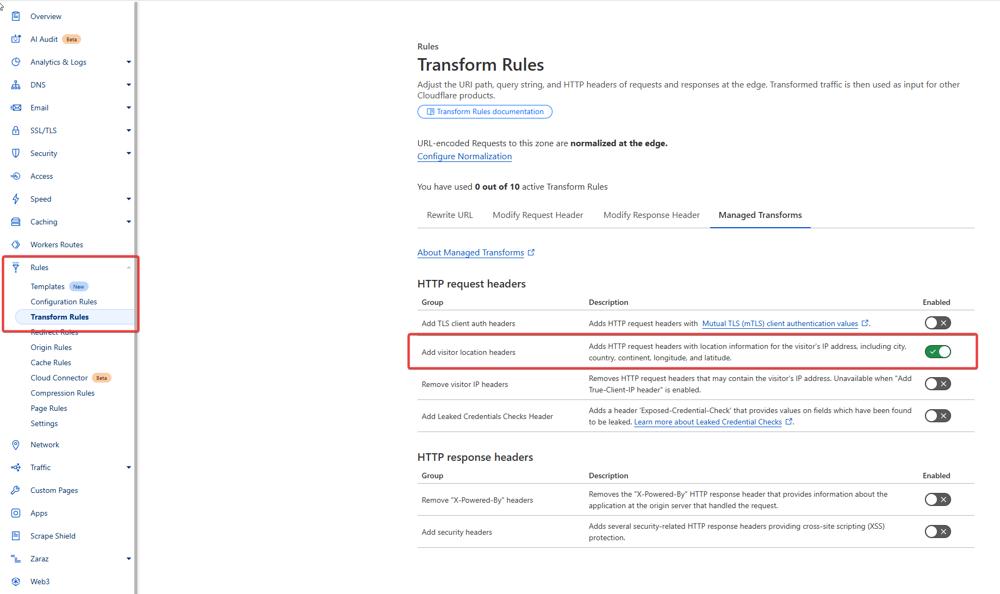

# Map Viz

A simple map visualization app built with Astro, Preact, and MapLibre GL JS. Upon visiting the site, location data is extracted from the Cloudflare request headers and stored in a SQLite database.

## Development

1. Create a [Turso](https://turso.tech/) account and create a new database.
2. Create a `.dev.vars` file based on `.dev.vars.example` and set the `TURSO_CONNECTION_URL` and `TURSO_AUTH_TOKEN` environment variables.
3. Ensure you're on Node.js 20.17.0 and PNPM 9.9.0.
4. Run `pnpm install` to install the dependencies.
5. Run `pnpm db:generate` to generate the database migrations.
6. Run `pnpm db:migrate` to apply the migrations.
7. Run `pnpm dev:all` to start the development server and the database studio.
8. To actually log the coordinates, you'll have to use [Cloudflare Tunnel](https://developers.cloudflare.com/cloudflare-one/connections/connect-networks/downloads/) to proxy the development server, else 0, 0 would be logged.
9. Just install `cloudflared` and run `cloudflared tunnel --url http://localhost:4317` to get a URL to visit.

## Deployment

1. Set the `TURSO_CONNECTION_URL` and `TURSO_AUTH_TOKEN` environment variables in the Cloudflare dashboard.
2. Also set the `NODE_VERSION` to `20.17.0` and `PNPM_VERSION` to `9.9.0`. It should look something like this:
   
3. Enable build cache
   
4. Deploy to your branch, connect your domain and also enable location headers and you're good to go! 🎉
   
