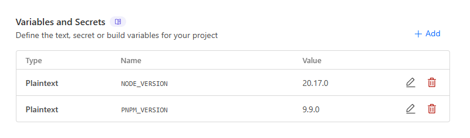
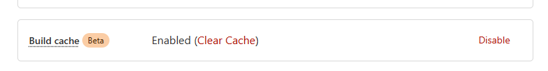
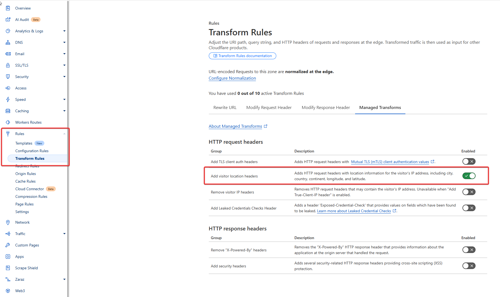

# MapViz

A simple map visualization app built with Astro, Preact, and MapLibre GL JS. Upon visiting the site, location data is extracted from the Cloudflare request headers and stored in a SQLite database.

## Development

1. Create a new Cloudflare D1 database.
2. Update the variables in `wrangler.toml` to match your database under `[[d1_databases]]`.
3. Create a `.dev.vars` and `.env` files based on `.dev.vars.example` and `.env.example` and set `CLOUDFLARE_ACCOUNT_ID`, `CLOUDFLARE_DATABASE_ID`, `CLOUDFLARE_D1_TOKEN` (you can refer [this](https://developers.cloudflare.com/fundamentals/api/get-started/create-token/) doc on how to create D1 specific token) and `CLOUDFLARE_D1_BINDING` environment variables.
4. Ensure you're on Node.js 20.17.0 and pnpm 9.9.0.
5. Run `pnpm install` to install the dependencies.
6. Run `pnpm db:generate` to generate the database migrations.
7. Run `pnpm db:migrate` to apply the migrations.
8. Run `pnpm dev:all` to start the development server and the database studio.
9. To actually log the coordinates, you'll have to use [Cloudflare Tunnel](https://developers.cloudflare.com/cloudflare-one/connections/connect-networks/downloads/) to proxy the development server, else 0, 0 would be logged.
10. Just install `cloudflared` and run `cloudflared tunnel --url http://localhost:4321` (or the port your dev server is running on) to get a URL to visit.

## Deployment

1. Set set the `NODE_VERSION` to `20.17.0` and `PNPM_VERSION` to `9.9.0`. It should look something like this:
   
2. Enable build cache
   
3. Deploy to your branch, connect your domain and also enable location headers and you're good to go! 🎉
   
